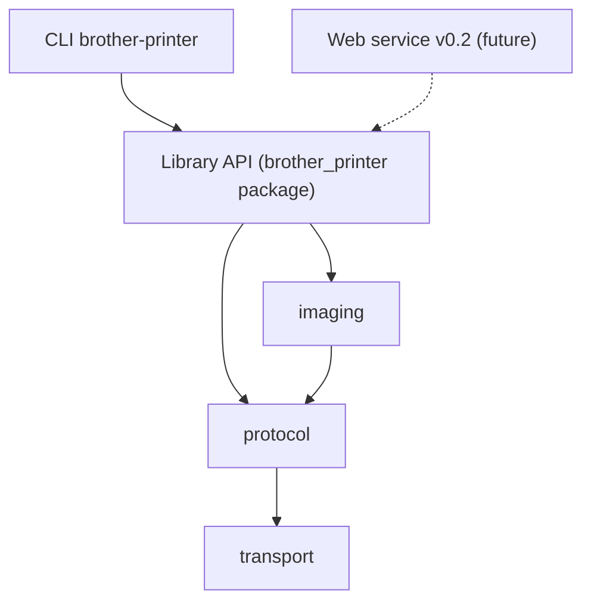

# ADR-0002: v0.1 architecture and package skeleton

## Status

Accepted — 2026-05-28

## Context

The [v0.1 roadmap](https://github.com/exoma-ch/brother-printer/issues/11) targets a
Linux USB CLI for the Brother PT-E920BT. [ADR-0001](0001-build-strategy.md) locks the
protocol family (P-touch raster) and build approach (from-scratch Python). Before
implementation begins, the codebase needs a clear layering so v0.1 CLI work does not
block a future local web service in v0.2.

Downstream issues [#4](https://github.com/exoma-ch/brother-printer/issues/4) through
[#8](https://github.com/exoma-ch/brother-printer/issues/8) will fill in transport,
protocol, imaging, and CLI layers. This ADR defines the boundaries those issues must
respect.

## Decision

Adopt a five-layer architecture with strict dependency direction:

### Layers

| Layer | Package | Responsibility | Issue |
| --- | --- | --- | --- |
| Transport | `brother_printer.transport` | Byte-level USB I/O, device discovery, timeouts | [#4](https://github.com/exoma-ch/brother-printer/issues/4) |
| Protocol | `brother_printer.protocol` | Pure P-touch raster encode/decode (bytes in, bytes out) | [#5](https://github.com/exoma-ch/brother-printer/issues/5) |
| Imaging | `brother_printer.imaging` | PIL image → 1-bit raster lines at 360 dpi | [#6](https://github.com/exoma-ch/brother-printer/issues/6) |
| Library API | `brother_printer` (root package) | High-level orchestration surface for consumers | #4–#8 |
| CLI | `brother_printer.cli` | Thin command-line entry points | [#7](https://github.com/exoma-ch/brother-printer/issues/7), [#8](https://github.com/exoma-ch/brother-printer/issues/8) |

### Layer rules

- **Transport** knows nothing about protocol commands or image formats.
- **Protocol** is pure (no I/O). It produces and consumes `bytes`; transport sends/receives them.
- **Imaging** produces raster line data consumed by the protocol encoder; it does not talk to USB.
- **CLI** orchestrates via the library API. It must not import `transport` or `protocol` directly.
- **Library API** (`brother_printer/__init__.py`) is the public surface. Concrete callables
  (e.g. `print_image`, `discover_printers`, `query_status`) will be added as #4–#8 land.
  No separate facade module in v0.1 (YAGNI).

### v0.2 web service (future, not built in v0.1)

A local HTTP service in v0.2 will accept print jobs and call the same library API the CLI
uses. It will depend on `brother_printer` only — not on `cli`, and not on individual
subpackages. This keeps the web layer a thin transport adapter over existing library logic.

## Consequences

### Positive

- Each layer is independently testable: protocol with golden files, imaging with synthetic
  images, transport with mock backends ([#9](https://github.com/exoma-ch/brother-printer/issues/9)).
- v0.2 web service reuses the library API without refactoring v0.1 CLI code.
- Clear ownership: each downstream issue maps to exactly one package.

### Constraints

- Cross-layer imports are banned except along the dependency arrows in the diagram above.
- CLI entry point registration in `pyproject.toml` belongs to #7, not this skeleton.
- No implementation logic in the skeleton packages — only module docstrings until their
  respective issues land.

## Alternatives considered

### Single flat module

**Rejected.** Would mix USB I/O, protocol encoding, image processing, and CLI parsing in one
file. Blocks independent testing and makes v0.2 web reuse require a large refactor.

### Separate `api.py` facade module

**Rejected for v0.1.** The root package (`brother_printer/__init__.py`) is sufficient as the
public surface. A dedicated facade adds a file with no behavior until #4–#8 define the API.
Revisit if the root `__init__.py` grows unwieldy.

### Split repositories per layer

**Rejected.** Premature for a single-printer v0.1. All layers share the same release cycle and
test infrastructure.

## References

### Architecture ADRs

- [ADR-0001: Build strategy for PT-E920BT](0001-build-strategy.md)

### Project issues

- [#2](https://github.com/exoma-ch/brother-printer/issues/2) — build-strategy ADR (dependency)
- [#3](https://github.com/exoma-ch/brother-printer/issues/3) — this ADR
- [#4](https://github.com/exoma-ch/brother-printer/issues/4) — USB transport
- [#5](https://github.com/exoma-ch/brother-printer/issues/5) — raster protocol
- [#6](https://github.com/exoma-ch/brother-printer/issues/6) — image pipeline
- [#7](https://github.com/exoma-ch/brother-printer/issues/7) — CLI print command
- [#8](https://github.com/exoma-ch/brother-printer/issues/8) — CLI status and info commands
- [#11](https://github.com/exoma-ch/brother-printer/issues/11) — v0.1 roadmap
