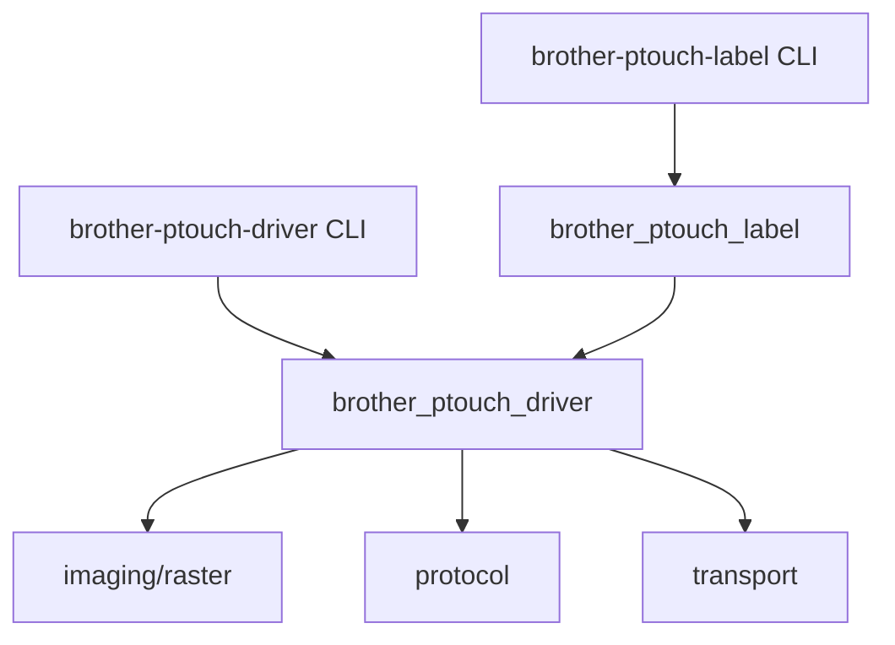

# ADR-0003: Driver and text decoupling (uv workspace)

## Status

Accepted — 2026-06-04 (layout symmetric under `packages/` — 2026-06-04; package rename — 2026-06-04)

## Context

[ADR-0002](0002-architecture.md) defined a five-layer monolith with imaging (raster + text) inside
`brother_ptouch_driver`. Text rendering (`render_text`, `print_text`) and the CLI `--text` path added
coupling that a future web service does not need. The driver contract should accept ready-to-print
images; text-to-label is a separate concern.

## Decision

Split the repository into a **uv workspace** with two packages under `packages/`:

| Package | Path | Responsibility |
| --- | --- | --- |
| `brother-ptouch-driver` | `packages/brother_ptouch_driver/` | USB transport, P-touch protocol, image-to-raster, print orchestration, `brother-ptouch-driver` CLI |
| `brother-ptouch-label` | `packages/brother_ptouch_label/` | Text rendering, `print_text`, `brother-ptouch-label` CLI |

The repo root holds only the virtual workspace `pyproject.toml` (dev dependency group, pytest
config). CI and the devcontainer use `just sync` (`uv sync --all-packages`) — no lifecycle script
hardcodes package paths.

### Workspace layout

```
pyproject.toml                 # virtual root: [tool.uv.workspace], dev deps, pytest
packages/
  brother_ptouch_driver/
    pyproject.toml
    src/brother_ptouch_driver/
    tests/
  brother_ptouch_label/
    pyproject.toml
    src/brother_ptouch_label/
    tests/
```

### Driver input contract

- **Library:** `print_image(PIL.Image)` and `print_png(bytes)` (PNG decode at the edge).
- **CLI:** image paths or CSV; no `--text` on `brother-ptouch-driver print`.

### Image height / scaling

Tape width maps to image **height** in pixels (`TapeWidth.print_area_pins`). Label **width** is
unconstrained (feed direction).

| Mode | Behavior |
| --- | --- |
| Default (`scale=False`) | Image height must equal print area; otherwise `ImageScalingError`. |
| `scale=True` / `--scale` | Integer up/downscale via nearest-neighbor; non-integer factors resample (may distort QR). |

See `brother_ptouch_driver.imaging.raster.resize_to_tape_width` and
[docs/vendor/tze-tape-widths.md](../vendor/tze-tape-widths.md).

### Dependency direction



- `brother-ptouch-label` depends on `brother-ptouch-driver` only (workspace source).
- Driver public API no longer exports `render_text`, `max_font_size`, or `print_text`.

### Web service (deferred)

A future `brother_ptouch_web` package under `packages/` will depend on `brother-ptouch-driver` only,
not on text or CLI.

## Consequences

### Positive

- Driver stays PNG/PIL-in; text and web are optional workspace members.
- Symmetric `packages/<name>/` layout matches standard uv monorepo practice.
- Strict sizing catches wrong assets early; `--scale` is explicit opt-in.
- v0.2 HTTP service can call `print_png` / `print_image` without text deps.

### Breaking

- `print_text`, `render_text`, `max_font_size` removed from `brother_ptouch_driver` top-level API.
- `brother-ptouch-driver print --text` removed; use `brother-ptouch-label` instead.
- `allow_distortion` renamed to `scale`; default no longer auto-scales integer multiples.
- Core source and tests moved from repo-root `src/` and `tests/` to `packages/brother_ptouch_driver/`.
- Distribution names `brother_printer` / `brother_printer_text` and CLIs `brother-printer` / `brother-label-text` renamed to `brother-ptouch-driver` / `brother-ptouch-label`.

## Alternatives considered

### Separate repositories per package

**Rejected.** Same rationale as ADR-0002: shared release cycle, tests, and vendor docs.

### Keep text in core behind optional extra

**Rejected.** Still couples public API and install graph; workspace split is clearer.

### Core package at repo root (`src/brother_ptouch_driver/`)

**Rejected after initial split.** Asymmetric with `packages/brother_ptouch_label/`; both packages
now live under `packages/` for clarity.

## References

- [ADR-0002: v0.1 architecture](0002-architecture.md)
- [TZe tape widths](../vendor/tze-tape-widths.md)
