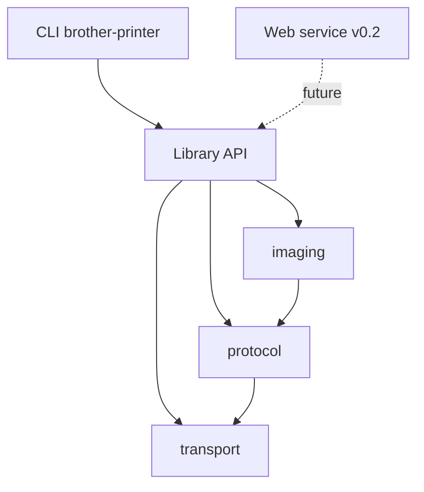

# [Issue 11]: [[DISCUSSION] v0.1 roadmap: USB CLI printing for PT-E920BT](https://github.com/exoma-ch/brother-printer/issues/11)

## Description

Strategic roadmap epic for **v0.1**: USB-only, Linux-only CLI that prints arbitrary images (QR PNGs as primary use case) on a Brother PT-E920BT with tape selection and auto-cut control.

## Context / Motivation

This repository provides open-source support for Brother label printers without proprietary Brother software. v0.1 targets the PT-E920BT industrial P-touch printer over USB. A future v0.2 will add a local web service; v0.1 architecture must keep the library API reusable.

## v0.1 Goal

From a Linux host:

```bash
brother-printer print qr.png --tape 12mm --auto-cut
```

Prints a pre-generated QR code PNG on the connected PT-E920BT.

## Scope

### In scope
- USB transport (Linux)
- P-touch raster protocol encoder + status decoder
- Image-to-raster pipeline tuned for QR sharpness
- CLI: `print`, `discover`, `status`, `info tapes`

### Out of scope (explicit)
- Bluetooth / Wi-Fi / network transport
- macOS / Windows
- Built-in QR/barcode/text generation
- Web service (v0.2)
- Other Brother models

## Architecture



## Child Issues (execution order)

### Phase 1 — Research & design
- [x] #1 — Collect official PT-E920BT documentation
- [x] #2 — Prior-art deep-dive and build-strategy ADR
- [x] #3 — Architecture ADR and package skeleton

### Phase 2 — Core implementation
- [x] #4 — USB transport layer with discover
- [x] #5 — P-touch raster protocol encoder and status decoder
- [x] #6 — Image-to-raster pipeline for QR quality
- [x] #9 — Loopback transport and golden-file tests *(can start in parallel with #5/#6)*

### Phase 3 — CLI & release
- [x] #7 — CLI print command
- [x] #8 — CLI status and info tapes commands
- [x] #10 — v0.1.0 release prep

## Open Questions

- Distribution beyond PyPI (container image?) — revisit at release time (#10)
- Structured logging — add issue if needed during implementation

## v0.2 Preview (not in scope)

Local web service accepting print jobs via HTTP, reusing the same library API built in v0.1.


---

# [Comment #1]() by [c-vigo]()

_Posted on June 8, 2026 at 07:37 AM_

v0.1.0 released: GitHub Release published and PR #34 merged to main (tag 0.1.0). All child issues (#1-#10, plus #19, #21, #22, #25, #31) are closed. Roadmap epic complete.

