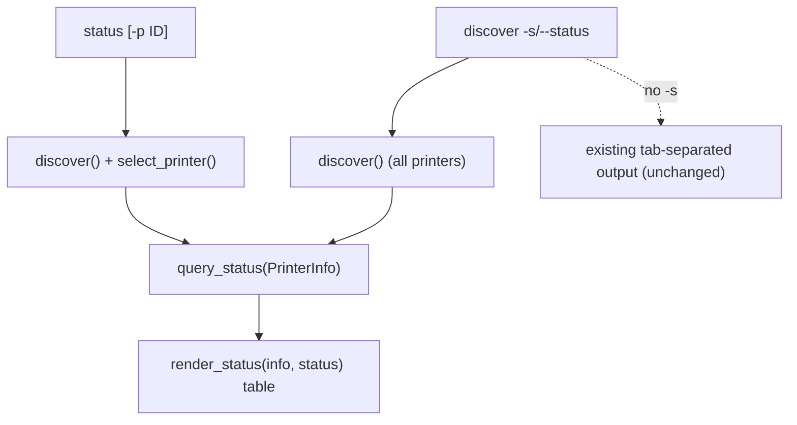

# [Issue 19]: [[FEATURE] Add status command and discover --status for live printer info](https://github.com/exoma-ch/brother-printer/issues/19)

## Description

Add live printer status to the CLI: a standalone `status` command and a `discover -s/--status` flag that show tape width, tape color, media type, readiness/errors, and idle/printing phase in a human-readable table. Plain `discover` output stays unchanged (tab-separated, machine-parseable).

## Problem Statement

`brother-printer discover` today only lists USB descriptors (identifier, product name, bus:address). It does not show what tape is loaded, whether the printer is ready, or if there are errors (cover open, no media, overheating, etc.). Users must guess tape width for `print --tape` or rely on print-time validation errors.

## Proposed Solution

1. **`status` command** — Query one printer (default: first found; optional `-p/--printer` identifier from discover) and print a human-readable status table.
2. **`discover -s/--status`** — Discover all connected printers and query status for each, rendering the same table format. Degrade gracefully per printer if status cannot be read (e.g. permission denied, device busy).
3. **Library refactor** — Extract `query_status()` and public `select_printer()` from `print_image()` so status querying is a single source of truth (matches ADR-0002 `query_status` API direction).

Example output:

```
PT-E920BT  04f9:20c7#000123456789  (bus 1, addr 5)
  Tape:       12 mm
  Color:      White
  Media:      Laminated
  Phase:      Idle
  Status:     Ready
```

Status fields come from the existing P-touch raster protocol (`ESC i S` → `decode_status()` → `PrinterStatus`).

## Alternatives Considered

- **Enrich default `discover` output** — Rejected to preserve the machine-parseable tab-separated contract used by `--printer`.
- **Always query status in discover** — Rejected; opening/claiming USB has side effects and can fail or interfere with active prints. Status query is opt-in via `-s` or the dedicated `status` command.
- **JSON/machine output** — Out of scope for v1; human-readable table only.

## Additional Context

- Status query requires opening the USB device (kernel driver detach); Linux udev permissions apply (`docs/install/linux-usb.md`).
- Not available from protocol/descriptors (out of scope): firmware version, battery percentage, richer model name.
- `print_image()` already performs an inline status query before printing; this feature extracts and reuses that logic.

## Impact

- **Who benefits:** CLI users checking loaded tape before printing, scripts/operators verifying printer readiness, developers debugging hardware setup.
- **Compatibility:** Backward compatible. Plain `discover` unchanged. New commands/flags only.

## Changelog Category

Added
---

# [Comment #1]() by [c-vigo]()

_Posted on June 1, 2026 at 03:32 PM_

## Implementation plan

### What the user wants
- A separate `status` command, plus `discover -s/--status` that does discovery + status.
- Show full status: tape width, tape color, media type, readiness/errors, idle/printing phase.
- Render as a human-readable table.

### Background (already in the codebase)
- `discover()` in `src/brother_printer/transport/usb.py` only reads USB descriptors — no device open.
- Status comes from the raster protocol: `status_request()` (`ESC i S`) + `decode_status()` returning `PrinterStatus` (media_width, media_type, tape_color, errors, phase_type, notification...). See `src/brother_printer/protocol/decoder.py` and `src/brother_printer/protocol/enums.py`.
- This exact query is already done inline inside `print_image()` in `src/brother_printer/printing.py`; we will extract and reuse it (SSoT).

### Design



#### 1. Library refactor — single source for status query
In `src/brother_printer/printing.py`:
- Extract a public `query_status(printer: PrinterInfo, *, timeout_ms: int = 5000) -> PrinterStatus` that opens `UsbTransport`, writes `status_request()`, reads `STATUS_REPLY_SIZE`, returns `decode_status(reply)`.
- Rename `_select_printer` -> public `select_printer` (keep behavior).
- Refactor `print_image()` to call both helpers instead of the inline block at lines 75-79.
- Export `query_status` (and keep `discover`) from `src/brother_printer/__init__.py`. This matches the future `query_status` API noted in `docs/adr/0002-architecture.md`.

#### 2. Human-readable renderer (shared by both commands)
New module `src/brother_printer/cli/render.py` with `render_status(info: PrinterInfo, status: PrinterStatus) -> str` producing a block like:

```
PT-E920BT  04f9:20c7#000123456789  (bus 1, addr 5)
  Tape:       12 mm
  Color:      White
  Media:      Laminated
  Phase:      Idle
  Status:     Ready        # or: Cover open / No media / Overheating ...
```

- Tape: `status.media_width.mm` mm, or `No tape` when `None`.
- Phase: `PhaseType.EDITING` -> `Idle`, `PRINTING` -> `Printing`.
- Status line: `Ready` when no errors and tape loaded; otherwise join `status.errors`; also surface `notification` (e.g. cover open) when relevant.
- Use small explicit label maps for `TapeColor`/`MediaType` (e.g. `NON_LAMINATED` -> `Non-laminated`, `HEAT_SHRINK_2_1` -> `Heat-shrink 2:1`) rather than naive `.name` formatting.

#### 3. CLI changes in `src/brother_printer/cli/main.py`
- Add `-s/--status` flag to `discover_cmd`:
  - Without `-s`: unchanged tab-separated output (existing tests stay green).
  - With `-s`: for each discovered printer call `query_status`; on per-printer `TransportError`/`ValueError`, print the printer header plus `Status: unavailable (<reason>)` and continue (graceful degrade). Render via `render_status`.
- Add new `status` command:
  - `-p/--printer` option (optional; default first found), mirroring `print`.
  - `discover()` -> `select_printer(id)` -> `query_status()` -> `render_status()`.
  - On `TransportError`/`DeviceNotFoundError`/`ValueError`: echo to stderr, `sys.exit(1)` (same pattern as `print_cmd`). Empty discovery -> `No Brother PT-E920BT printers found.` + exit 1.

#### 4. Tooling + docs (SSoT)
- Add a `status` recipe to `justfile.project` next to `discover`, and document the `-s` flag.
- Add a CHANGELOG entry under `## Unreleased` > `### Added` in `CHANGELOG.md`, referencing this issue.

### TDD order (test first, commit each phase)
- Library: test `query_status` (mock `UsbTransport` write/read_exact) and `select_printer`; confirm `print_image` still passes.
- CLI `discover -s` (mock `query_status`): full-status happy path, no-tape case, and per-printer error degrades gracefully without failing the command.
- CLI `status`: happy path, `--printer` selection + not-found, transport error exits 1, no-printers exits 1.
- Renderer: unit tests for label formatting and the ready/error/no-tape branches.

### Notes / decisions
- Plain `discover` output and its tests are intentionally left unchanged to preserve the machine-parseable contract used by `--printer`.
- `query_status` opens/claims the USB device (kernel driver detach); on Linux this needs udev permissions (see `docs/install/linux-usb.md`), hence the graceful-degrade handling in `discover -s`.
- Not available from the protocol/descriptors (so out of scope): firmware version, battery percentage, richer model name.

