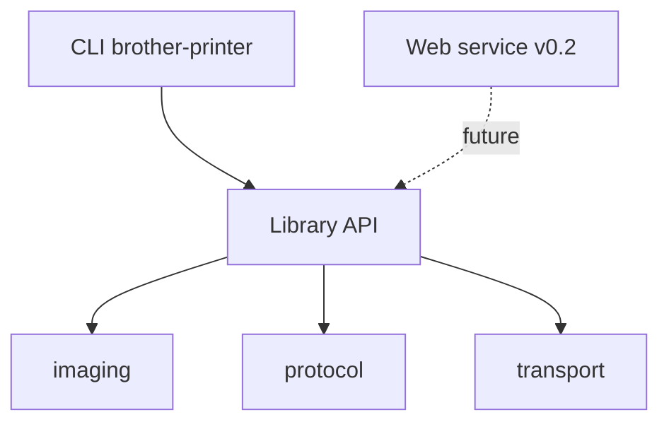

# [Issue 3]: [[CHORE] Architecture ADR and package skeleton for v0.1](https://github.com/exoma-ch/brother-printer/issues/3)

## Description

Define the v0.1 architecture and create an empty package skeleton that separates concerns for future v0.2 web service reuse.

## Problem Statement

We need a clear layering (transport → protocol → imaging → library API → CLI) before implementation begins, so v0.1 CLI work does not block a future local web service.

## Acceptance Criteria

- [ ] Publish architecture ADR at `docs/adr/0002-architecture.md` documenting layers: transport, protocol, imaging, library API, CLI
- [ ] Document v0.2 web service as a future consumer of the library API (not built in v0.1)
- [ ] Create empty package skeleton:
  - `src/brother_printer/transport/`
  - `src/brother_printer/protocol/`
  - `src/brother_printer/imaging/`
  - `src/brother_printer/cli/`
- [ ] Each package has `__init__.py` with module docstring describing its responsibility
- [ ] No implementation logic yet (YAGNI)

## Implementation Notes

- Depends on build-strategy ADR (#2) for final module boundaries
- Library API surface can be stubbed as a thin facade module if helpful

## Related Issues

- Depends on #2
- Blocks #4, #5, #6, #7, #8
- Part of v0.1 roadmap epic

## Priority

High — establishes structure for all implementation work.

---

# [Comment #1]() by [c-vigo]()

_Posted on May 28, 2026 at 03:21 PM_

Part of v0.1 roadmap epic #11

